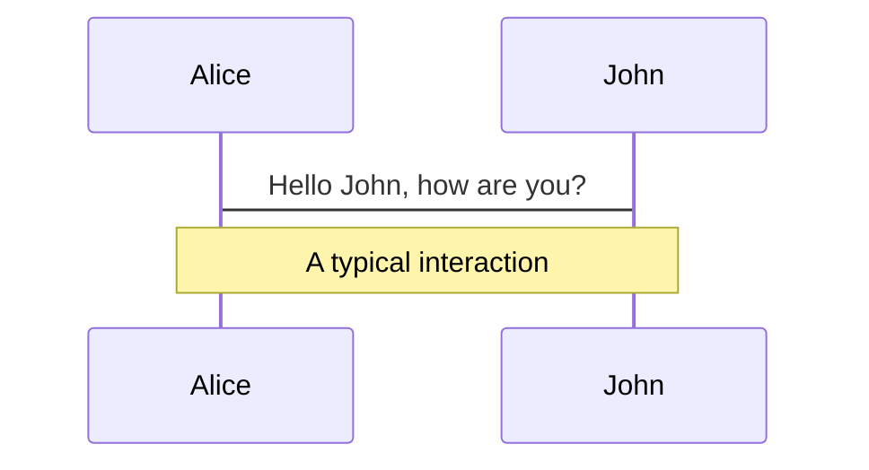
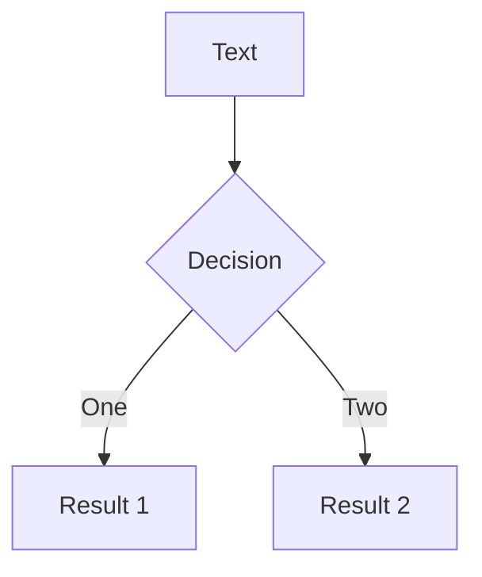
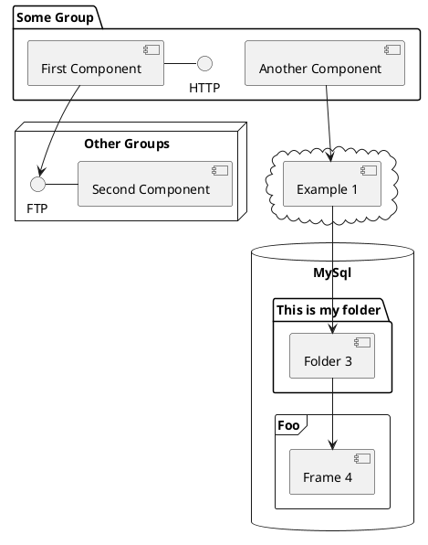

---
# try also 'default' to start simple
theme: apple-basic
class: 'text-center'
# https://sli.dev/custom/highlighters.html
highlighter: shiki
# show line numbers in code blocks
lineNumbers: true
# some information about the slides, markdown enabled
info: |
  ## Slidev Starter Template
  Presentation slides for developers.

  Learn more at [Sli.dev](https://sli.dev)
drawings:
  persist: false
css: unocss
layout: center
--- 
# Is it worth learning Vue in 2022 and why not?

---

# Przemysław Jan Beigert

<br>

- **Github** - https://github.io/przemyslawjanpietrzak
- **Dev.to** - https://dev.to/przemyslawjanpietrzak
- **Stackoverflow** - https://stackoverflow.com/users/5914352/przemyslaw-jan-beigert
- ‍**Linkedin** - https://www.linkedin.com/in/przemys%C5%82aw-beigert-b0b149b4/
<br>

---

# About Vue 

<br>

<div grid="~ cols-2 gap-4">
<div>

<v-click>

- **component base SPA framework** 

</v-click>
<v-click>

- **1.0.0 in 2015** 

</v-click>
<v-click>

- **Used by ~19% of professionals developers** 

- **3.4kk download / week** 

- **198k Github stars** 

</v-click>
<v-click>


</v-click>
<v-click>

- **3.0.0 in 2020** 

</v-click>

</div>
<div>


</div>
</div>

---

```ts {all|1-12|3|4|6-8|14-40|18|15,19-21|22|23-27|27-32|3|33-39} {maxHeight:'550px'} 
<template>
  <div>
    <div>Tasks: {{ count }}</div>
    <div v-if="isLoading">spinner</div>
    <ul>
      <li v-for="task in tasks" :key="task.id">
        <todo-item :task="task" />
      </li>
    </ul>
    <button @click="addTodo(todo)">add todo</button>
  </div>
</template>

<script>
import TodoItem from "./TodoItem.vue";

export default {
  name: "TodoApp",
  components: {
    TodoItem,
  },
  props: ['tasks'],
  data() {
    return {
      isLoading: false,
    };
  },
  computed: {
    count() {
      return this.tasks.length;
    },
  },
  methods: {
    addTodo(todo) {
      this.isLoading = true;
      this.todos.push(todo);
      this.isLoading = false;
    },
  },
};
</script>
```

<!-- <arrow v-click="3" x1="400" y1="420" x2="230" y2="330" color="#564" width="3" arrowSize="1" /> -->

[^1]: [Learn More](https://sli.dev/guide/syntax.html#line-highlighting)

<style>
.footnotes-sep {
  @apply mt-20 opacity-10;
}
.footnotes {
  @apply text-sm opacity-75;
}
.footnote-backref {
  display: none;
}

</style>

<!--
access from this
mutation rerender
-->

---

# Vue organization

<br>

<div grid="~ cols-2 gap-4">
<div>

- **Router**
- **State manager** 
- **CLI**
- **Jest utils** 
- **Eslint plugin** 
- **Dev tools** 
- **VSC plugin** 

</div>
<div>


</div>
</div>

<!--
CLI
-->

---
layout: intro
---

# Interesting?


---
layout: intro
---

# Comparison

---
layout: intro
---

# I/O Validation

---

# I/O React 

```ts {all} {maxHeight:'550px'} 
import { Child } from "./child";

export const Component = ({ input }) => (
  <Child onClick={(dataFromChild) => console.log(dataFromChild)} input={input}>{input}</Child>
);
```


<style>
.footnotes-sep {
  @apply mt-20 opacity-10;
}
.footnotes {
  @apply text-sm opacity-75;
}
.footnote-backref {
  display: none;
}

</style>


---

# I/O React + TS

```ts {all} {maxHeight:'550px'} 

import { Child } from "./child";

interface Props {
  input: string;
  output: (arg: number) => void;
}

export const Component: React.FC<Props> = ({ input, output }) => (
  <Child onClick={() => output(42)} input={input}>{input}</Child>
);
```


<style>
.footnotes-sep {
  @apply mt-20 opacity-10;
}
.footnotes {
  @apply text-sm opacity-75;
}
.footnote-backref {
  display: none;
}

</style>

---

# I/O React + JS

```js {all} {maxHeight:'550px'} 
import PropTypes from "prop-types";
import { Child } from "./child";

const Component = ({ input, output }) => (
  <Child onClick={() => output(42)} input={input}>{input}</Child>
);

Component.propTypes = {
  input: PropTypes.string,
  output: PropTypes.func,
}
```

<style>
.footnotes-sep {
  @apply mt-20 opacity-10;
}
.footnotes {
  @apply text-sm opacity-75;
}
.footnote-backref {
  display: none;
}

</style>

---

```ts {all|2,13-21|2,12,24|all|14-19} {maxHeight:'550px'} 
<template>
  <child :input="input" @output="onEvent($event)">{{ input }}</child>
</template>

<script>
import Child from "./Child.vue";

export default {
  components: {
    Child,
  },
  emits: ["output"], // since 3.0.0, optional
  props: {
    input: {
      type: String,
      required: true,
      validate(input) {
        return true;
      },
    },
  },
  actions: {
    output() {
      this.$emit("output", 42);
    },
    onEvent(ev) {}
  },
};
</script>
```

<style>
.footnotes-sep {
  @apply mt-20 opacity-10;
}
.footnotes {
  @apply text-sm opacity-75;
}
.footnote-backref {
  display: none;
}

</style>

---

# I/O Angular

```ts {all|7-9,12-13|7,14|all} {maxHeight:'550px'} 
import { Component, Input } from '@angular/core';
import { Observable } from 'rxjs';

@Component({
    selector: 'app-todo-item',
    template: '
    <child (click)="output.emit(42)" [input]="input">
      {{ input }} {{ input$ | async }}
    </child>',
})
export class AppComponent {
  @Input() input: string;
  @Input() input$: Observable<string>;
  @Output() output = new EventEmitter<number>();
}
```

<style>
.footnotes-sep {
  @apply mt-20 opacity-10;
}
.footnotes {
  @apply text-sm opacity-75;
}
.footnote-backref {
  display: none;
}

</style>

<!--
Only in compilation
-->

---


# Styles

---


# Styles React

```ts {all|8-13} {maxHeight:'550px'} 
import styled from "styled-components";

export const Button = styled.a`
  color: white;
  &:last-child {
    margin-bottom: 0;
  }
  ${(props) =>
    props.primary &&
    css`
      background: white;
      color: black;
    `}
`;
```

<style>
.footnotes-sep {
  @apply mt-20 opacity-10;
}
.footnotes {
  @apply text-sm opacity-75;
}
.footnote-backref {
  display: none;
}

</style>

---


# Styles Vue

```ts {all|11|all} {maxHeight:'550px'} 
<template>
  <div>42</div>
</template>

<styles scoped lang="scss">
@import "colors.scss";

div {
  color: $color;
}
:v-deep span {
  color: red;
}
</styles>
```

<style>
.footnotes-sep {
  @apply mt-20 opacity-10;
}
.footnotes {
  @apply text-sm opacity-75;
}
.footnote-backref {
  display: none;
}

</style>


---

# Styles Angular

```ts {all} {maxHeight:'550px'} 
import { Component, ViewEncapsulation } from '@angular/core';

@Component({
    selector: 'app-component',
    stylesUrl: `
      ::ng-deep span {
        color: red;
      }
    `,
    template: `<div>42</div>`,
    encapsulation: ViewEncapsulation.None | ViewEncapsulation.Emulated | ViewEncapsulation.ShadowDom,
})
export class AppComponent {}
```

<style>
.footnotes-sep {
  @apply mt-20 opacity-10;
}
.footnotes {
  @apply text-sm opacity-75;
}
.footnote-backref {
  display: none;
}
</style>

---

# Forms

---

# Forms React
```ts {all} {maxHeight:'550px'} 
import { useState } from "react";

export const Form = () => {
  const [input, setInput] = useState("");
  return <input value={input} onChange={(e) => setInput(e.target.value)} />;
};
```

<style>
.footnotes-sep {
  @apply mt-20 opacity-10;
}
.footnotes {
  @apply text-sm opacity-75;
}
.footnote-backref {
  display: none;
}
</style>

---

# Forms React
```ts {all} {maxHeight:'550px'} 
import React from "react";
import { useForm } from "react-hook-form";

export const From = () => {
  const {
    register,
    handleSubmit,
    formState: { errors },
  } = useForm();
  const onSubmit = (data) => {};

  return (
    <form onSubmit={handleSubmit(onSubmit)}>
      <input defaultValue="test" {...register("example")} />

      <input {...register("exampleRequired", { required: true })} />
      {errors.exampleRequired && <span>This field is required</span>}

      <input type="submit" />
    </form>
  );
}
```

<style>
.footnotes-sep {
  @apply mt-20 opacity-10;
}
.footnotes {
  @apply text-sm opacity-75;
}
.footnote-backref {
  display: none;
}
</style>

---

# Forms Vue
```ts {all|2,10|all} {maxHeight:'550px'} 
<template>
  <input v-model="name" /> {{ name }}
</template>

<script>
export default {
  name: "Component",
  data() {
    return {
      name: "",
    };
  },
};
</script>
```

<style>
.footnotes-sep {
  @apply mt-20 opacity-10;
}
.footnotes {
  @apply text-sm opacity-75;
}
.footnote-backref {
  display: none;
}
</style>

---

# Forms Angular
```ts {all} {maxHeight:'550px'} 
import { NgModule } from '@angular/core';
import { ReactiveFormsModule } from '@angular/forms';

@NgModule({
  imports: [
    ReactiveFormsModule
  ],
})
export class AppModule { }
```

<style>
.footnotes-sep {
  @apply mt-20 opacity-10;
}
.footnotes {
  @apply text-sm opacity-75;
}
.footnote-backref {
  display: none;
}
</style>

---

```ts {all|24|25-28|7,11-16} {maxHeight:'550px'} 
import { Component } from '@angular/core';
import { FormGroup, FormBuilder, Validators }  from '@angular/forms';

@Component({
  selector: 'form-component',
  template: `
  <form [formGroup]="form">
    <label for="firstName">
      FirstName:
    </label>
    <input
      id="firstName"
      type="text"
      [class.is-invalid]="formValidator.isDirty(form, 'firstName')"
      formControlName="firstName"
    >
    <button type="submit" (submit)="onSubmit()">Submit</button>
  </form>
  `,
})
export class FormComponent {
  form: FormGroup;

  constructor(private fb: FormBuilder) {
    this.form = this.fb.group({
      firstName: [null, [Validators.required, Validators.minLength(3), Validators.maxLength(42)]],
      lastName: [null, [Validators.required, Validators.minLength(3), Validators.maxLength(42)]],
    });
  }
  onSubmit() {}
}
```

<style>
.footnotes-sep {
  @apply mt-20 opacity-10;
}
.footnotes {
  @apply text-sm opacity-75;
}
.footnote-backref {
  display: none;
}
</style>

---

# Update

---

# Update React
```ts {all} {maxHeight:'550px'} 
import { useEffect } from "react";

export const Component = ({ attr }) => {
  useEffect(() => {
    console.log(attr);
  }, [attr]);

  return <div>{input}</div>;
};
```

<style>
.footnotes-sep {
  @apply mt-20 opacity-10;
}
.footnotes {
  @apply text-sm opacity-75;
}
.footnote-backref {
  display: none;
}
</style>

---

# Update Vue

```ts {all|13|14|all} {maxHeight:'550px'} 
<template><div>{{ field }}</div></template>
        
<script>
import TodoItem from "./TodoItem.vue";

export default {
  methods: {
    increase() {
      this.field++;
    },
  },
  watch: {
    field(newValue, oldValue) {},
    'some.nested.key'(newValue, oldValue) {}
  },
};
</script>
```

<style>
.footnotes-sep {
  @apply mt-20 opacity-10;
}
.footnotes {
  @apply text-sm opacity-75;
}
.footnote-backref {
  display: none;
}
</style>

---

# Update Angular

```ts {all|7|9-13|all} {maxHeight:'550px'} 
import {Component, OnChanges, SimpleChanges} from '@angular/core';
 
@Component({
  selector: 'app-component',
  templateUrl: './app.component.html'
})
export class AppComponent implements OnChanges {
  attr: string;
  ngOnChanges({ attr }: SimpleChanges) {
      if (attr.oldValue !== attr.newValue) {
          // HERE
      }
  }
}
```

<style>
.footnotes-sep {
  @apply mt-20 opacity-10;
}
.footnotes {
  @apply text-sm opacity-75;
}
.footnote-backref {
  display: none;
}
</style>

---

# Update Angular

```ts {all} {maxHeight:'550px'} 
import {Component, Input} from '@angular/core';

@Component({
  selector: 'app-component',
  templateUrl: './app.component.html'
})
export class AppComponent {
  private _attr: string;

  get attr() {
    return this._attr;
  }
  @Input('attr') set attr(value: string) {
    this._attr = value;
    // HERE
  }
} 
```

<style> 
.footnotes-sep {
  @apply mt-20 opacity-10;
}
.footnotes {
  @apply text-sm opacity-75;
}
.footnote-backref {
  display: none;
}
</style>

---
layout: intro
---

# But?

---
layout: intro
---

# State manager

---

# Redux

<br>

<div grid="~ cols-2 gap-4">
<div>

</div>
<div>


</div>
</div>

---


# Redux actions

```ts {all} {maxHeight:'550px'} 
import { createAction } from "@reduxjs/toolkit";

export const increment = createAction("counter/increment");
export const decrement = (amount) => {
  return {
    type: "DECREMENT",
    payload: amount,
  };
};
```

<style> 
.footnotes-sep {
  @apply mt-20 opacity-10;
}
.footnotes {
  @apply text-sm opacity-75;
}
.footnote-backref {
  display: none;
}
</style>


---

# Redux reducers

```ts {all|5-6|1,7-10} {maxHeight:'550px'} 
import produce from "immer";

export const reducer = (state = initialState, action) => {
  switch (action.type) {
    case "counter/incremented":
      return { ...state, value: state.value + 1 };
    case "counter/decrement":
      return produce(state, (draft) => {
        draft.value--;
      });
    default:
      return state;
  }
};  
```

<style> 
.footnotes-sep {
  @apply mt-20 opacity-10;
}
.footnotes {
  @apply text-sm opacity-75;
}
.footnote-backref {
  display: none;
}
</style>

---


# Redux reducers

```ts {all} {maxHeight:'550px'} 
import { createDraftSafeSelector, createSelector } from "@reduxjs/toolkit";

export const selectSelf = (state) => state;
export const unsafeSelector = createSelector(
  selectSelf,
  (state) => state.value
);
export const draftSafeSelector = createDraftSafeSelector(
  selectSelf,
  (state) => state.value
);
```

<style> 
.footnotes-sep {
  @apply mt-20 opacity-10;
}
.footnotes {
  @apply text-sm opacity-75;
}
.footnote-backref {
  display: none;
}
</style>


---

# Vuex

<br>

<div grid="~ cols-2 gap-4">
<div>

</div>
<div>


</div>
</div>

---


# Vuex

```ts {all} {maxHeight:'550px'} 
import { createStore } from "vuex";

const moduleA = {
  state: () => ({}),
  mutations: {},
  actions: {},
  getters: {},
};

export const store = createStore({
  modules: {
    a: moduleA,
  },
});
```

<style> 
.footnotes-sep {
  @apply mt-20 opacity-10;
}
.footnotes {
  @apply text-sm opacity-75;
}
.footnote-backref {
  display: none;
}
</style>

---


# Vuex action

```ts {all} {maxHeight:'550px'} 
export const actions = {
  actionA({ commit, dispatch, store }, payload) {
    dispatch("actionB", store.data);
    commit("increment", payload);
    commit("decrement", payload);

    return 42;
  },
};
```

<style> 
.footnotes-sep {
  @apply mt-20 opacity-10;
}
.footnotes {
  @apply text-sm opacity-75;
}
.footnote-backref {
  display: none;
}
</style>

---

# Vuex mutation

```ts {all} {maxHeight:'550px'} 
export const mutations = {
  increment(state, payload) {
    state.count += payload;
    Vue.set(state.arr, index, payload);
  },
};
```

<style> 
.footnotes-sep {
  @apply mt-20 opacity-10;
}
.footnotes {
  @apply text-sm opacity-75;
}
.footnote-backref {
  display: none;
}
</style>

---

# Vuex connect

```ts {all|6,9|11} {maxHeight:'550px'} 
<script>
import { mapActions, mapGetters } from "vuex";

export default {
  computed: {
    ...mapGetters("module2", ["valueB2"])
  }
  methods: {
    ...mapActions("module1", ["actionA1"]),
    method() {
      const actionResult = this.actionA1(this.valueB2);
    },
  },
};
</script>
```

<style> 
.footnotes-sep {
  @apply mt-20 opacity-10;
}
.footnotes {
  @apply text-sm opacity-75;
}
.footnote-backref {
  display: none;
}
</style>

---


# Vuex connect

```ts {all} {maxHeight:'550px'} 
<script>
import { mapMutations, mapState } from "vuex";

export default {
  computed: {
    ...mapState("module2", "store2")
  }
  methods: {
    ...mapMuttions("module1", ["mutation"]),
    method() {
      this.mutation(this.valueFromGetter, this.store2);
    },
  },
};
</script>
```

<style> 
.footnotes-sep {
  @apply mt-20 opacity-10;
}
.footnotes {
  @apply text-sm opacity-75;
}
.footnote-backref {
  display: none;
}
</style>


---

# NGRX


<br>

<div grid="~ cols-2 gap-4">
<div>

</div>
<div>


</div>
</div>

---

# NGRX effects

```ts {all|3-7|9-18} {maxHeight:'550px'} 
@Injectable()
export class AppEffects {
  constructor(
    private actions$: Actions<AppActions>,
    private apiService: ApiService,
    private store$: Store<RootStore>,
  ) {}

  @Effect()
  data$ = this.actions$.pipe(
    ofType<Action>(AppAcions.Action),
    withLatestFrom(this.store$.select(selector)),
    switchMap(([payload, dataFromSelector]) => {
      return this.apiService
        .fetch()
        .pipe(map((response) => new OtherAction(response)));
    }),
  );
}
```

<style> 
.footnotes-sep {
  @apply mt-20 opacity-10;
}
.footnotes {
  @apply text-sm opacity-75;
}
.footnote-backref {
  display: none;
}
</style>

---

# NGRX effects

```ts {all|3-4,14-15} {maxHeight:'550px'} 
 @Component({
  template: `
    <div *ngIf="isLoading$ | async">loading<div>
    <div *ngElse>{{ data$ | async }}<div>
  `
})
export class AppComponent implements OnInit {
  isLoading$: Observable<boolean>;
  data$: Observable<Date>;

  constructor(private store$: Store<RootStore>) {}

  ngOnInit() {
    this.isLoading$ = this.store$.pipe(select(selectIsLoading));
    this.data$ = this.store$.pipe(select((store) => store.data));

    this.store$.dispatch(new Action());
  }
}
```

<style> 
.footnotes-sep {
  @apply mt-20 opacity-10;
}
.footnotes {
  @apply text-sm opacity-75;
}
.footnote-backref {
  display: none;
}
</style>

---

# NGRX effects

```ts {all} {maxHeight:'550px'} 
it('AppEffect', () => {
  actions$ = hot('-a', { a : { type: 'action type' }});
 
  expectObservable(effects.data$).toBe('-c|', {
    c: {
      type: 'another action type',
      payload: 42,
    }
  });
});
```

<style> 
.footnotes-sep {
  @apply mt-20 opacity-10;
}
.footnotes {
  @apply text-sm opacity-75;
}
.footnote-backref {
  display: none;
}
</style>

---
layout: intro
---

# Summary

---
layout: intro
---

# Unit testing

---

# Vue test utils  

```ts {all|5-9|12-18|20-24} {maxHeight:'550px'} 
import { shallowMount } from "@vue/test-utils";
import Component from "./Component.vue";

describe("Badge", () => {
  const createComponent = ({ label = "" } = {}) => {
    return shallowMount(Component, {
      propsData: { label },
      components: { Child },
    });
  };

  it.each(["test42", "wpłynąłem na suchego przestwór oceanu"])(
    "should render text from label props", (label) => {
      const component = createComponent({ label });

      expect(component.find(".label").text()).toContain(label);
    }
  );

  it("should render child with prop ", () => {
    const component = createComponent();

    expect(component.find("child-stub").props().attr).toBe(42);
  });
});
```

<style> 
.footnotes-sep {
  @apply mt-20 opacity-10;
}
.footnotes {
  @apply text-sm opacity-75;
}
.footnote-backref {
  display: none;
}
</style>

---

# React testing library

```ts {all} {maxHeight:'550px'} 
import React from "react";
import { shallow } from "enzyme";

import Component from "./Component";

describe("<MyComponent />", () => {
  it("renders a label", () => {
    const wrapper = shallow(<MyComponent />);
    expect(wrapper.find("label")).toContains("label");
  });
});
```

<style> 
.footnotes-sep {
  @apply mt-20 opacity-10;
}
.footnotes {
  @apply text-sm opacity-75;
}
.footnote-backref {
  display: none;
}
</style>

---

# Angular testing

```ts {all} {maxHeight:'550px'} 
import { TestBed, async } from '@angular/core/testing';
import { AppComponent } from './app.component';
  
describe('AppComponent', () => {
  beforeEach(async(() => {
    TestBed.configureTestingModule({
      declarations: [
        AppComponent,
      ],
    }).compileComponents();
  }));
  
  it('should render title in a h1 tag', () => {
    const fixture = TestBed.createComponent(AppComponent);
    fixture.detectChanges();
    const compiled = fixture.debugElement.nativeElement;
    expect(compiled.querySelector('.label').textContent).toContain('label');
  });
});
```

<style> 
.footnotes-sep {
  @apply mt-20 opacity-10;
}
.footnotes {
  @apply text-sm opacity-75;
}
.footnote-backref {
  display: none;
}
</style>


---
layout: intro
---

# React > Vue?

---


# When Vue 

<br>

<div grid="~ cols-2 gap-4">
<div>

<v-click>

- **Small apps** 

</v-click>
<v-click>

- **Presentation > Logic** 

</v-click>
<v-click>


</v-click>
<v-click>

- **PoC / Demo** 

</v-click>
<v-click>

- **Small teams** 

</v-click>


</div>
<div>


</div>
</div>

---
layout: intro
---

# Should I learn Vue?

---

# When I should learn Vue?

<v-click>

- **Junior developer**

</v-click>
<v-click>

- **Senior developer**

</v-click>
<v-click>

- **Angular developer**

</v-click>
<v-click>

- **Backend  developer**

</v-click>

---
layout: intro
---

# Is it worth learning Vue?

---
layout: intro
---

# Rather not

---
layout: center
---

# Thank you :*

---

# Navigation

Hover on the bottom-left corner to see the navigation's controls panel, [learn more](https://sli.dev/guide/navigation.html)

### Keyboard Shortcuts

|     |     |
| --- | --- |
| <kbd>right</kbd> / <kbd>space</kbd>| next animation or slide |
| <kbd>left</kbd>  / <kbd>shift</kbd><kbd>space</kbd> | previous animation or slide |
| <kbd>up</kbd> | previous slide |
| <kbd>down</kbd> | next slide |

<!-- https://sli.dev/guide/animations.html#click-animations -->

<p v-after class="absolute bottom-23 left-45 opacity-30 transform -rotate-10">Here!</p>

---

# Code

Use code snippets and get the highlighting directly![^1]

```ts {all|2|1-6|9|all}
interface User {
  id: number
  firstName: string
  lastName: string
  role: string
}

function updateUser(id: number, update: User) {
  const user = getUser(id)
  const newUser = { ...user, ...update }
  saveUser(id, newUser)
}
```

<arrow v-click="3" x1="400" y1="420" x2="230" y2="330" color="#564" width="3" arrowSize="1" />

[^1]: [Learn More](https://sli.dev/guide/syntax.html#line-highlighting)

<style>
.footnotes-sep {
  @apply mt-20 opacity-10;
}
.footnotes {
  @apply text-sm opacity-75;
}
.footnote-backref {
  display: none;
}
</style>

---

# Components

<div grid="~ cols-2 gap-4">
<div>

You can use Vue components directly inside your slides.

We have provided a few built-in components like `<Tweet/>` and `<Youtube/>` that you can use directly. And adding your custom components is also super easy.

```html
<Counter :count="10" />
```

<!-- ./components/Counter.vue -->
<Counter :count="10" m="t-4" />

Check out [the guides](https://sli.dev/builtin/components.html) for more.

</div>
<div>

```html
<Tweet id="1390115482657726468" />
```

<Tweet id="1390115482657726468" scale="0.65" />

</div>
</div>


---
class: px-20
---

# Themes

Slidev comes with powerful theming support. Themes can provide styles, layouts, components, or even configurations for tools. Switching between themes by just **one edit** in your frontmatter:

<div grid="~ cols-2 gap-2" m="-t-2">

```yaml
---
theme: default
---
```

```yaml
---
theme: seriph
---
```


</div>

Read more about [How to use a theme](https://sli.dev/themes/use.html) and
check out the [Awesome Themes Gallery](https://sli.dev/themes/gallery.html).

---
preload: false
---

# Animations

Animations are powered by [@vueuse/motion](https://motion.vueuse.org/).

```html
<div
  v-motion
  :initial="{ x: -80 }"
  :enter="{ x: 0 }">
  Slidev
</div>
```

<div class="w-60 relative mt-6">
  <div class="relative w-40 h-40">
    
    
    
  </div>

  <div
    class="text-5xl absolute top-14 left-40 text-[#2B90B6] -z-1"
    v-motion
    :initial="{ x: -80, opacity: 0}"
    :enter="{ x: 0, opacity: 1, transition: { delay: 2000, duration: 1000 } }">
    Slidev
  </div>
</div>

<!-- vue script setup scripts can be directly used in markdown, and will only affects current page -->
<script setup lang="ts">
const final = {
  x: 0,
  y: 0,
  rotate: 0,
  scale: 1,
  transition: {
    type: 'spring',
    damping: 10,
    stiffness: 20,
    mass: 2
  }
}
</script>

<div
  v-motion
  :initial="{ x:35, y: 40, opacity: 0}"
  :enter="{ y: 0, opacity: 1, transition: { delay: 3500 } }">

[Learn More](https://sli.dev/guide/animations.html#motion)

</div>

---

# LaTeX

LaTeX is supported out-of-box powered by [KaTeX](https://katex.org/).

<br>

Inline $\sqrt{3x-1}+(1+x)^2$

Block
$$
\begin{array}{c}

\nabla \times \vec{\mathbf{B}} -\, \frac1c\, \frac{\partial\vec{\mathbf{E}}}{\partial t} &
= \frac{4\pi}{c}\vec{\mathbf{j}}    \nabla \cdot \vec{\mathbf{E}} & = 4 \pi \rho \\

\nabla \times \vec{\mathbf{E}}\, +\, \frac1c\, \frac{\partial\vec{\mathbf{B}}}{\partial t} & = \vec{\mathbf{0}} \\

\nabla \cdot \vec{\mathbf{B}} & = 0

\end{array}
$$

<br>

[Learn more](https://sli.dev/guide/syntax#latex)

---

# Diagrams

You can create diagrams / graphs from textual descriptions, directly in your Markdown.

<div class="grid grid-cols-3 gap-10 pt-4 -mb-6">







</div>

[Learn More](https://sli.dev/guide/syntax.html#diagrams)


---
layout: center
class: text-center
---

# Learn More

[Documentations](https://sli.dev) · [GitHub](https://github.com/slidevjs/slidev) · [Showcases](https://sli.dev/showcases.html)
